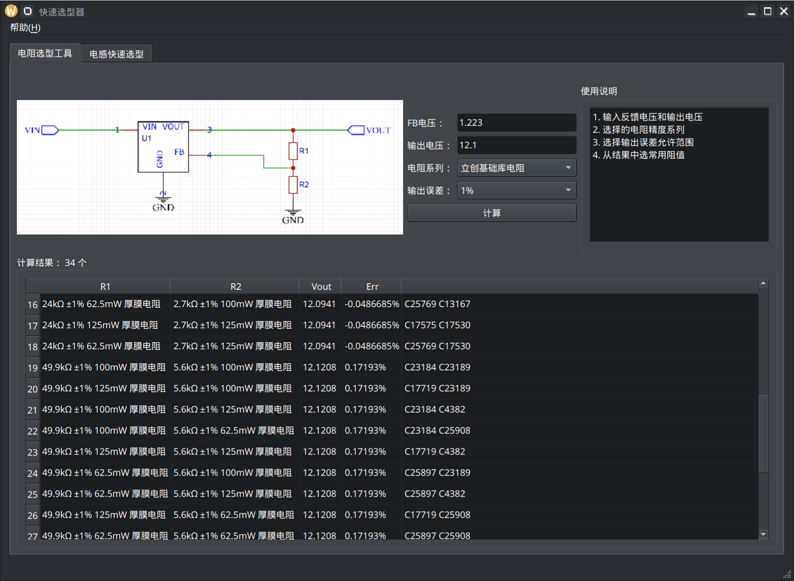

# FB电阻选型工具

快速找出能实现所要的 FB 分压的电阻组合。并且可以专门找到 JLC 的基础库电阻。省去换料费。

# 下载

点击 [Releases](https://github.com/microcai/JLC_R_util/releases) 按钮，到下载页面。
然后根据你的系统，选择下载  eda-tool-win64.zip 活着 eda-tool-linux.zip。

解压后运行里面的可执行程序即可。

